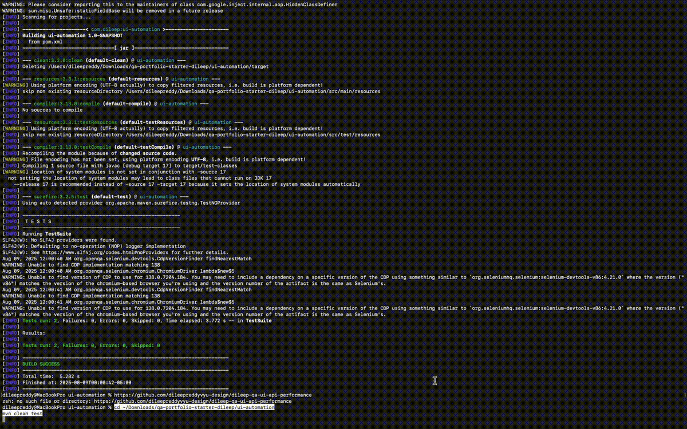

# QA Portfolio Project – UI, API, and Performance Testing

This project demonstrates a full QA lifecycle for a demo e-commerce application, covering:

- **Manual Testing** – Test cases, RTM, defect log
- **UI Automation** – Selenium WebDriver (Java + TestNG)
- **API Testing** – Postman + Newman CLI
- **Performance Testing** – Apache JMeter
- **Database Validation** – SQL queries for backend checks

---

## Tools & Technologies

- **Manual Testing:** Excel, Jira/GitHub Issues  
- **UI Automation:** Selenium WebDriver, Java, TestNG, Maven, WebDriverManager  
- **API Testing:** Postman, Newman CLI  
- **Performance Testing:** Apache JMeter  
- **Database:** MySQL / Oracle SQL  
- **Version Control:** Git, GitHub  
- **Methodologies:** Agile/Scrum, STLC  

---

## Project Structure
/docs
TestPlan.md
TestCases.xlsx
TraceabilityMatrix.xlsx
DefectLog.xlsx
/ui-automation
pom.xml
testng.xml
src/test/java/... (automation scripts)
/api-tests
Ecommerce.postman_collection.json
Ecommerce.postman_environment.json
/performance
api_load_test.jmx
/reports
manual-test-report.md
automation-report.md
api-newman-report.html
performance-summary.md


---

## Manual Testing Deliverables

- **Test Plan:** Scope, objectives, risks, entry/exit criteria  
- **Test Cases:** 40+ manual cases for functional, regression, smoke, and negative testing  
- **Traceability Matrix:** Mapping requirements to test cases  
- **Defect Log:** Realistic bug reports with severity, steps, and screenshots  

---

## UI Automation



- Automated critical flows for login, sorting, cart, and checkout  
- Cross-browser support (Chrome, Edge)  
- Assertions for validation of UI elements and text  

**Run automation:**
```bash
cd ui-automation
mvn clean test
mvn clean test -Dbrowser=edge
```
## API Testing
Newman CLI run of the Postman collection.

- **HTML Report:** [View API Newman Report](https://dileepreddyvyu-design.github.io/dileep-qa-ui-api-performance/reports/api-newman-report.html)
- **Collection:** `api-tests/Ecommerce.postman_collection.json`
- **Environment:** `api-tests/Ecommerce.postman_environment.json`

## Performance Testing (JMeter)
25 virtual users with a 30-second ramp-up on the public API.

**JMeter HTML Dashboard:** [View Performance Report](https://dileepreddyvyu-design.github.io/dileep-qa-ui-api-performance/index.html)
- **JTL Results (raw):** [reports/jmeter-results.jtl](reports/jmeter-results.jtl)

**Summary screenshots**


```
Performance Testing
JMeter test with 25 virtual users and 30-second ramp-up.
Collected throughput, 90th/95th percentile, and error rates.

Reports
Manual Testing Report
Automation Report
API Test Report
Performance Report

How to Run
Download this repository from GitHub.
Install Java and Maven on your system.
For automation tests:
cd ui-automation
mvn clean test

For API tests:
newman run api-tests/Ecommerce.postman_collection.json
Author: Dileep Reddy Vuyyuru
📧 vuyyurudileepreddy@gmail.com
🔗 LinkedIn(https://www.linkedin.com/in/dileepreddyvuyyuru/)
